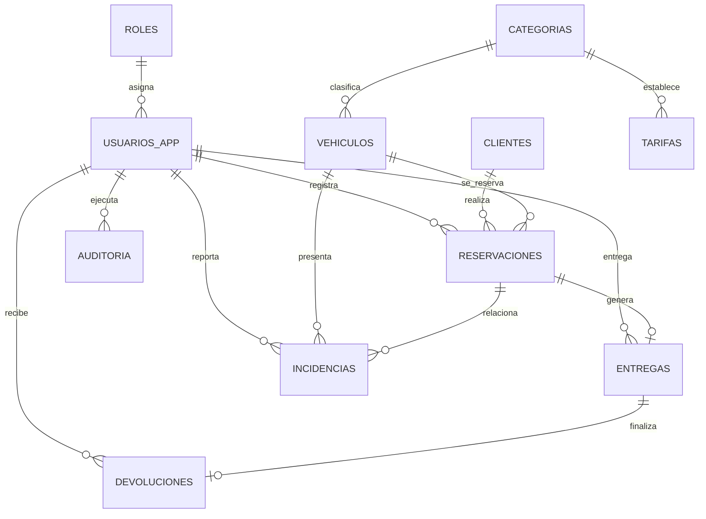

# Modelo de datos inicial

## Sistema de Renta de Autos

- **Issue:** S1-05 — Diseñar modelo de datos
- **Estado:** En revisión
- **Responsable principal:** Miguel Ángel Machorro García
- **Revisor técnico:** Julio César Pérez Romero

## 1. Objetivo

Definir el modelo de datos inicial del Sistema de Renta de Autos, incluyendo entidades, relaciones, claves primarias, claves foráneas, restricciones e índices.

Este diseño servirá como base para la migración inicial de MySQL correspondiente a S1-06.

## 2. Decisiones de diseño

- Todas las entidades utilizan una clave primaria numérica llamada `id`.
- Las claves foráneas utilizan el sufijo `_id`.
- Las fechas de creación y actualización se registran con `created_at` y `updated_at`.
- Los registros con historial no se eliminan físicamente; se cambia su estado.
- Las contraseñas se almacenan únicamente como hash.
- La placa y el VIN de cada vehículo son únicos.
- Los importes monetarios utilizan `DECIMAL(10,2)`.
- La validación de reservaciones traslapadas se realiza en Spring Boot dentro de una transacción.
- Se agrega la entidad `roles`, necesaria para autenticación, autorización y S1-09.

## 3. Entidades

### 3.1 roles

Catálogo de roles autorizados dentro del sistema.

| Campo | Tipo | Restricciones |
|---|---|---|
| id | BIGINT UNSIGNED | PK, AUTO_INCREMENT |
| nombre | VARCHAR(50) | NOT NULL, UNIQUE |
| descripcion | VARCHAR(255) | NULL |
| activo | BOOLEAN | NOT NULL, DEFAULT TRUE |
| created_at | DATETIME | NOT NULL |
| updated_at | DATETIME | NOT NULL |

Roles iniciales propuestos:

- ADMINISTRADOR
- AGENTE
- SUPERVISOR
- AUDITOR

### 3.2 usuarios_app

Usuarios que pueden iniciar sesión y operar el sistema.

| Campo | Tipo | Restricciones |
|---|---|---|
| id | BIGINT UNSIGNED | PK, AUTO_INCREMENT |
| rol_id | BIGINT UNSIGNED | FK → roles.id, NOT NULL |
| nombre | VARCHAR(120) | NOT NULL |
| correo | VARCHAR(150) | NOT NULL, UNIQUE |
| password_hash | VARCHAR(255) | NOT NULL |
| activo | BOOLEAN | NOT NULL, DEFAULT TRUE |
| ultimo_acceso | DATETIME | NULL |
| created_at | DATETIME | NOT NULL |
| updated_at | DATETIME | NOT NULL |

Nunca se almacena ni se devuelve una contraseña en texto plano.

### 3.3 clientes

Personas que reservan o rentan vehículos.

| Campo | Tipo | Restricciones |
|---|---|---|
| id | BIGINT UNSIGNED | PK, AUTO_INCREMENT |
| nombre | VARCHAR(100) | NOT NULL |
| apellidos | VARCHAR(150) | NOT NULL |
| correo | VARCHAR(150) | NULL, UNIQUE |
| telefono | VARCHAR(20) | NOT NULL |
| numero_licencia | VARCHAR(50) | NOT NULL, UNIQUE |
| licencia_vencimiento | DATE | NOT NULL |
| direccion | VARCHAR(255) | NULL |
| activo | BOOLEAN | NOT NULL, DEFAULT TRUE |
| created_at | DATETIME | NOT NULL |
| updated_at | DATETIME | NOT NULL |

### 3.4 categorias

Clasificación de los vehículos y base para sus tarifas.

| Campo | Tipo | Restricciones |
|---|---|---|
| id | BIGINT UNSIGNED | PK, AUTO_INCREMENT |
| nombre | VARCHAR(80) | NOT NULL, UNIQUE |
| descripcion | VARCHAR(255) | NULL |
| deposito_base | DECIMAL(10,2) | NOT NULL, DEFAULT 0 |
| activo | BOOLEAN | NOT NULL, DEFAULT TRUE |
| created_at | DATETIME | NOT NULL |
| updated_at | DATETIME | NOT NULL |

### 3.5 tarifas

Precio aplicable a una categoría durante un periodo determinado.

| Campo | Tipo | Restricciones |
|---|---|---|
| id | BIGINT UNSIGNED | PK, AUTO_INCREMENT |
| categoria_id | BIGINT UNSIGNED | FK → categorias.id, NOT NULL |
| precio_dia | DECIMAL(10,2) | NOT NULL |
| cargo_atraso_dia | DECIMAL(10,2) | NOT NULL, DEFAULT 0 |
| fecha_inicio | DATE | NOT NULL |
| fecha_fin | DATE | NULL |
| activo | BOOLEAN | NOT NULL, DEFAULT TRUE |
| created_at | DATETIME | NOT NULL |
| updated_at | DATETIME | NOT NULL |

### 3.6 vehiculos

Vehículos disponibles para reservación y renta.

| Campo | Tipo | Restricciones |
|---|---|---|
| id | BIGINT UNSIGNED | PK, AUTO_INCREMENT |
| categoria_id | BIGINT UNSIGNED | FK → categorias.id, NOT NULL |
| placa | VARCHAR(15) | NOT NULL, UNIQUE |
| vin | VARCHAR(17) | NOT NULL, UNIQUE |
| marca | VARCHAR(80) | NOT NULL |
| modelo | VARCHAR(80) | NOT NULL |
| anio | SMALLINT UNSIGNED | NOT NULL |
| color | VARCHAR(40) | NULL |
| kilometraje | DECIMAL(10,1) | NOT NULL, DEFAULT 0 |
| estado | VARCHAR(30) | NOT NULL |
| created_at | DATETIME | NOT NULL |
| updated_at | DATETIME | NOT NULL |

Estados iniciales:

- DISPONIBLE
- RESERVADO
- RENTADO
- MANTENIMIENTO
- BAJA

### 3.7 reservaciones

Solicitud de un cliente para utilizar un vehículo durante un periodo.

| Campo | Tipo | Restricciones |
|---|---|---|
| id | BIGINT UNSIGNED | PK, AUTO_INCREMENT |
| cliente_id | BIGINT UNSIGNED | FK → clientes.id, NOT NULL |
| vehiculo_id | BIGINT UNSIGNED | FK → vehiculos.id, NOT NULL |
| creado_por_id | BIGINT UNSIGNED | FK → usuarios_app.id, NOT NULL |
| fecha_inicio | DATETIME | NOT NULL |
| fecha_fin | DATETIME | NOT NULL |
| estado | VARCHAR(30) | NOT NULL |
| tarifa_dia | DECIMAL(10,2) | NOT NULL |
| total_estimado | DECIMAL(10,2) | NOT NULL |
| observaciones | TEXT | NULL |
| created_at | DATETIME | NOT NULL |
| updated_at | DATETIME | NOT NULL |

Estados iniciales:

- PENDIENTE
- CONFIRMADA
- CANCELADA
- EN_CURSO
- FINALIZADA

### 3.8 entregas

Registro de la entrega física del vehículo al cliente.

| Campo | Tipo | Restricciones |
|---|---|---|
| id | BIGINT UNSIGNED | PK, AUTO_INCREMENT |
| reservacion_id | BIGINT UNSIGNED | FK → reservaciones.id, NOT NULL, UNIQUE |
| entregado_por_id | BIGINT UNSIGNED | FK → usuarios_app.id, NOT NULL |
| fecha_entrega | DATETIME | NOT NULL |
| kilometraje_salida | DECIMAL(10,1) | NOT NULL |
| combustible_salida | DECIMAL(5,2) | NOT NULL |
| condicion_salida | TEXT | NOT NULL |
| observaciones | TEXT | NULL |
| created_at | DATETIME | NOT NULL |
| updated_at | DATETIME | NOT NULL |

### 3.9 devoluciones

Registro de la devolución del vehículo.

| Campo | Tipo | Restricciones |
|---|---|---|
| id | BIGINT UNSIGNED | PK, AUTO_INCREMENT |
| entrega_id | BIGINT UNSIGNED | FK → entregas.id, NOT NULL, UNIQUE |
| recibido_por_id | BIGINT UNSIGNED | FK → usuarios_app.id, NOT NULL |
| fecha_devolucion | DATETIME | NOT NULL |
| kilometraje_entrada | DECIMAL(10,1) | NOT NULL |
| combustible_entrada | DECIMAL(5,2) | NOT NULL |
| condicion_entrada | TEXT | NOT NULL |
| cargo_atraso | DECIMAL(10,2) | NOT NULL, DEFAULT 0 |
| cargo_danos | DECIMAL(10,2) | NOT NULL, DEFAULT 0 |
| total_final | DECIMAL(10,2) | NOT NULL |
| observaciones | TEXT | NULL |
| created_at | DATETIME | NOT NULL |
| updated_at | DATETIME | NOT NULL |

### 3.10 incidencias

Daños, fallas, multas u otros problemas relacionados con un vehículo.

| Campo | Tipo | Restricciones |
|---|---|---|
| id | BIGINT UNSIGNED | PK, AUTO_INCREMENT |
| vehiculo_id | BIGINT UNSIGNED | FK → vehiculos.id, NOT NULL |
| reservacion_id | BIGINT UNSIGNED | FK → reservaciones.id, NULL |
| registrado_por_id | BIGINT UNSIGNED | FK → usuarios_app.id, NOT NULL |
| tipo | VARCHAR(50) | NOT NULL |
| descripcion | TEXT | NOT NULL |
| costo_estimado | DECIMAL(10,2) | NOT NULL, DEFAULT 0 |
| estado | VARCHAR(30) | NOT NULL |
| fecha_reporte | DATETIME | NOT NULL |
| fecha_resolucion | DATETIME | NULL |
| created_at | DATETIME | NOT NULL |
| updated_at | DATETIME | NOT NULL |

Estados iniciales:

- ABIERTA
- EN_REVISION
- RESUELTA

### 3.11 auditoria

Historial de acciones relevantes realizadas en el sistema.

| Campo | Tipo | Restricciones |
|---|---|---|
| id | BIGINT UNSIGNED | PK, AUTO_INCREMENT |
| usuario_id | BIGINT UNSIGNED | FK → usuarios_app.id, NULL |
| accion | VARCHAR(100) | NOT NULL |
| entidad | VARCHAR(80) | NOT NULL |
| entidad_id | BIGINT UNSIGNED | NULL |
| resultado | VARCHAR(30) | NOT NULL |
| valores_anteriores | JSON | NULL |
| valores_nuevos | JSON | NULL |
| direccion_ip | VARCHAR(45) | NULL |
| fecha_hora | DATETIME | NOT NULL |

`usuario_id` puede ser nulo para registrar intentos fallidos de inicio de sesión.

La auditoría nunca debe almacenar contraseñas, tokens ni información secreta.

## 4. Diagrama entidad-relación

## 5. Restricciones de negocio

1. El correo de cada usuario es único.
2. La placa y el VIN de cada vehículo son únicos.
3. El número de licencia de cada cliente es único.
4. La fecha final de una reservación debe ser posterior a la inicial.
5. No pueden existir reservaciones activas traslapadas para el mismo vehículo.
6. Una reservación puede tener como máximo una entrega.
7. Una entrega puede tener como máximo una devolución.
8. El kilometraje de devolución no puede ser menor al de entrega.
9. Las tarifas, depósitos, cargos y totales no pueden ser negativos.
10. Un vehículo en mantenimiento o dado de baja no puede reservarse.
11. Todo usuario activo debe tener un rol asignado.
12. Los registros históricos no deben eliminarse físicamente.
13. La autorización se valida en el backend según el rol autenticado.

## 6. Índices propuestos

| Entidad | Índice |
|---|---|
| usuarios_app | UNIQUE(correo) |
| usuarios_app | INDEX(rol_id, activo) |
| clientes | UNIQUE(numero_licencia) |
| vehiculos | UNIQUE(placa) |
| vehiculos | UNIQUE(vin) |
| vehiculos | INDEX(categoria_id, estado) |
| tarifas | INDEX(categoria_id, activo, fecha_inicio, fecha_fin) |
| reservaciones | INDEX(cliente_id) |
| reservaciones | INDEX(vehiculo_id, estado, fecha_inicio, fecha_fin) |
| incidencias | INDEX(vehiculo_id, estado) |
| auditoria | INDEX(usuario_id, fecha_hora) |
| auditoria | INDEX(entidad, entidad_id) |

El índice de reservaciones ayuda a consultar disponibilidad, pero no impide por sí mismo los traslapes. Spring Boot deberá validarlos dentro de una transacción.

## 7. Política de claves foráneas

- Se recomienda `ON UPDATE CASCADE`.
- Se recomienda `ON DELETE RESTRICT` para registros con historial.
- En auditoría, `usuario_id` puede utilizar `ON DELETE SET NULL`.
- Los vehículos, clientes y usuarios deben desactivarse en lugar de eliminarse.

## 8. Dependencias

Este diseño es utilizado por:

- S1-06 — Crear migración inicial de la base de datos.
- S1-08 — Implementar autenticación.
- S1-09 — Implementar roles y permisos base.
- Funcionalidades futuras de clientes, vehículos, reservaciones y auditoría.

## 9. Decisiones pendientes de revisión

- Confirmar los nombres definitivos de los roles.
- Confirmar si una reservación requiere vehículo específico desde su creación.
- Confirmar el formato de control del nivel de combustible.
- Confirmar si las tarifas pueden traslapar periodos de vigencia.
- Confirmar qué acciones deben registrarse obligatoriamente en auditoría.
- Confirmar si los permisos se almacenarán en tablas o se definirán en Spring Boot.
- Confirmar las reglas de cancelación y cargos por atraso.

## 10. Revisión

| Revisión | Responsable | Estado |
|---|---|---|
| Revisión funcional | Equipo | Pendiente |
| Arquitectura de datos | Julio César Pérez Romero | Pendiente |
| Reglas y criterios | Miguel Ángel Machorro García | Pendiente |
| Aprobación para migración | Oscar Arturo Peña Valdez | Pendiente |